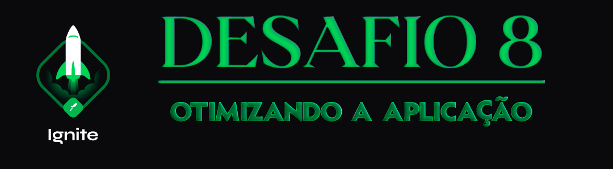

<div align="center">
  
</div>

<h1 align="center"> RocketSeat 🚀 Ignite ReactJS 🔥</h1>

<p align="center">
  <a href="https://rocketseat.com.br">
    
  </a>
  
  
  
</p>

## 🧠 Detalhes do desafio

Nesse desafio você deverá performar uma aplicação React utilizando das ferramentas e dicas aprendidas durante o módulo **Performando apps com ReactJS**.

Se você fez o desafio opcional **Componentizando a aplicação** deve lembrar que se trata de uma aplicação que exibe uma listagem de filmes por categoria com base na categoria selecionada e que esses dados vem de uma API (fake API com JSON Server).

Com essa aplicação componentizada, você deve aplicar os conceitos de performance no React para melhorar esse app.

## ⚙️ Instalação do projeto

## Clone este repositório e acesse o diretório

```sh
$ git clone git@github.com:augustohermes/desafio-08-otimizando-a-aplicacao.git && cd desafio-08-otimizando-a-aplicacao
```

## Instale as dependências necessárias

```sh
$ yarn
```

## Execute o comando `yarn server` para iniciar o servidor json-server

## Após, `yarn dev` para iniciar o modo de desenvolvimento

## Por fim, execute o seguinte comando para compilar para produção:

```sh
$ yarn build
```

## A aplicação irá rodar em http://localhost:8080

<br>

Feito com ❤️ por [Augusto Hermes](https://github.com/augustohermes) 👋.
